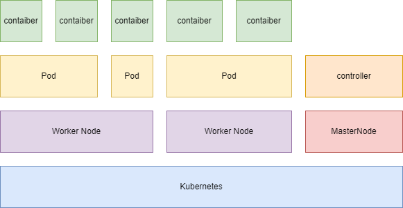

# Kubernetes (K8s)

- 自動デプロイ、スケーリング、アプリ・コンテナの運用自動化のために設計されたオープンソースのプラットフォーム

## Kubernetesの概要

- コンテナを Pod と呼ばれる単位で複数のノードに配布して実行管理する。
- クライアントからのアクセスを適切にノード上の Pod に転送する仕組みを備えている。
- コンテナやノードがダウンしても代わりに他のノードでコンテナを起動できる。
- サービスを停止することなく、コンテナをローリングアップデートしたりアップデートを中断してロールバックすることが可能。

## Kubernetesのコンポーネント
Kubernetesをデプロイすると、クラスターが展開される。

- Kubernetesクラスターは、 コンテナ化されたアプリケーションを実行する、ノードと呼ばれるワーカーマシンの集合。すべてのクラスターには少なくとも1つのワーカーノードがある。

- ワーカーノードは、アプリケーション又は、アプリケーションワークロードのコンポーネントであるPodをホストする。 ワーカーノードは、のコンポーネントであるPodをホストする。

- マスターノードは、クラスター内のワーカーノードとPodを管理でき、複数のマスターノードを使用して、クラスターにフェイルオーバーと高可用性を提供する。

- コントロールプレーンは、クラスター内のワーカーノードとPodを管理します。本番環境では、コントロールプレーンは複数のコンピューターを使用し、クラスターは複数のノードを使用し、耐障害性や高可用性を提供できる。

## コントロールプレーンコンポーネント
コントロールプレーンコンポーネントは、クラスターに関する全体的な決定(スケジューリングなど)を行う。また、クラスターイベントの検出および応答を行う(たとえば、deploymentのreplicasフィールドが満たされていない場合に、新しい Pod を起動する等)。

## ノードコンポーネント
ノードコンポーネントはすべてのノードで実行され、稼働中のPodの管理やKubernetesの実行環境を提供する

## Image

## word
### デプロイメント(Deployment)

- Deployment は Kubernetes で管理するアプリケーションの単位

### ポッド(Pod)

- Deployment が作成されると、アプリケーションを実行するノードが自動的に選択(スケジュール)され、実行される。この実行の単位を Pod と呼ぶ。
- Podは、1つ以上のアプリケーションコンテナ(Dockerなど)のグループとそれらのコンテナの共有リソースを表すKubernetesの抽象概念。 Podには以下のものが含まれる:
  - 共有ストレージ(ボリューム)
  - ネットワーキング(クラスターに固有のIPアドレス)
  - コンテナのイメージバージョンや使用するポートなどの、各コンテナをどう動かすかに関する情報

### ノード(Node)

- Podは常にノード上で動作し、ノードはKubernetesではワーカーマシンであり、クラスターによって仮想、物理マシンのどちらであってもかまわない。
- 各ノードはマスターによって管理される。
- ノードは複数のPodを持つことができ、Kubernetesマスターはクラスター内のノード間でPodのスケジュールを自動的に処理する。マスターの自動スケジューリングは各ノードで利用可能なリソースを考慮に入れる。

### サービス(Service)

- アプリケーション(Deployment)を外部に公開するには Service を作成
  - ClusterIP - クラスター内部のIPでServiceを公開。クラスター内部からのみアクセス可能。
  - NodePort - NATを使用してServiceを公開。クラスター外部からのアクセスが可能。
  - LoadBalancer - ロードバランサでServiceを公開。Minikubeではサポートされていない。
  - ExternalName - FQDN と Kube-DNS を用いてServiceを公開。

### ローリングアップデート

- Kubernetes を用いると、サービスを停止することなく、複数台稼働している Pod をひとつずつアップデートしていくことができる

## よく利用するコマンド
#### NameSpace一覧を確認
- kubectl get namespace

#### pod一覧を確認
- kubectl get pod -n [namespace名]

#### ログの確認
- kubectl logs -n [namespace名] [pod名] 
- kubectl logs -n -f [namespace名] [pod名]  
  - リアルタイムで確認

#### svc(Service)一覧を確認
- kubectl get svc -n [namespace名] [pod名] 

#### podを削除
- kubectl delete -n [namespace名] [pod名] 

#### deployment一覧を確認
- kubectl get deploy -n [namespace名]

#### deploymentの編集
- kubectl edit deploy -n [namespace名] [deployment名]

#### ポートフォワーディング
- kubectl port-forward n [namespace名] [pod名] 8080:8080

#### rs(Replica Set)一覧を確認
- kubectl get (rs/deploy)

#### pod/rc/rs/svcの詳細を確認する
- kubectl describe pods -n [namespace名] [pod名] 

####  Pod（コンテナ）上でコマンドを実行
- kubectl exec [Pod名] [コマンド]

#### イメージの更新（Rolling Update）
- kubectl set image deployment [デプロイメント名] [イメージ名]=[イメージ名]:[タグ]