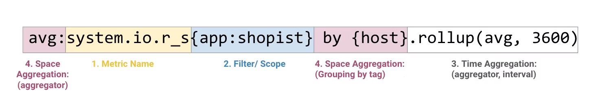

# サービス名
Datadog
# 公式HP
- https://www.datadoghq.com/

# 概要
- モニタリング&分析SaaSである。  
- DatadogはAgentを監視したいサービスやアプリケーションなどに組み込み、
Agentが収集(もしくはAgentに送信された)情報を、Datadogへ送信することで可視化された情報を確認することができる。

# 主な機能

- クラウドサービスやアプリケーション、サーバの状態などのモニタリング  
- 650 以上のクラウドサービス、ミドルウェアなどに対応  
- リクエストや処理分類ごとの実行時間などが容易に確認可能  
- ログの保管、検索が可能　　
- 利用する機能ごとにコスト（料金）がかかる

# 利用手順
1. AGENT のインストール  
   - Datadog にデータを送信するホストからイベントとメトリクスを収集

2. インテグレーションをセットアップ
   - 600 以上のビルトインインテグレーションにより、メトリクス、トレース、ログを収集し、Datadog に送信することができる。

3. アプリで使用を開始
   - Datadog で収集したデータを可視化し、ダッシュボード、アラート、モニターなどを作成することができる。

# 機能について
## Agent
- Datadog Agent は、ホストで実行されるソフトウェアで、監視したいサービスやアプリケーションなどに組み込ム必要がある。
- ホストからイベントとメトリクスを収集し、Datadog に送信し、モニタリングとパフォーマンスのデータを分析できる。
- Datadogはオープンソースになっており、下記から取得できる。
  - https://github.com/DataDog/datadog-agent

## メトリクス
### メトリクスとは
メトリクスは、レイテンシーからエラー率、ユーザーのサインアップまで、環境に関するあらゆる情報を経時的に追跡できる数値

Datadog では、メトリクスデータは値とタイムスタンプを持つデータポイントとして収集され、格納される。  
`[ 17.82,  22:11:01 ]`

一連のデータポイントが 1 つの時系列として格納される。  
`[ 17.82,  22:11:01 ]`  
`[  6.38,  22:11:12 ]`  
`[  2.87,  22:11:38 ]`  
`[  7.06,  22:12:00 ]`  

タイムスタンプが秒の端数であるメトリクスは、最も近い秒に丸められ、同じタイムスタンプを持つポイントがある場合、最新のポイントが前のポイントを上書きされる。

### メリット
- システムの全体像を見ることができ、環境の状態を一目で評価できる。
  -  ユーザーが Web サイトをロードする速度や、サーバーの平均メモリ消費量などを視覚化できる。
- リソースをどれだけ消費しているかを正確に知ることができる。
- 下記を追跡することも可能。
  - ビジネスに固有のメトリクス (カスタムメトリクス)
  - ユーザーログインの数、ユーザーカートのサイズ、チームのコードコミットの頻度
  - etc.

### 視覚化

Datadogを用いることでメトリクス視覚化を可能とする。  
下記のサービスでDatadog全体でメトリクスを視覚化してグラフを作成することができる。
- メトリクスエクスプローラー
- ダッシュボード
- ノートブック

### メトリクスのクエリ
ダッシュボード、ノートブック、モニターのいずれを使用しても、グラフの作成方法は共通して下記である。
グラフエディタ UI を使用するか、生のクエリ文字列を直接変更するからのいずれかの方法により、グラフを作成ができる。

### メトリクスクエリの構造

## APM - Application Performance Monitoring
APMとはアプリケーションの処理時間を可視化したもの。  

リクエスト(処理)全体にかかった時間、その内訳としてDBアクセスにかかった時間、内部計算処理を行った時間など、詳細に確認することができる。
さらにリクエストを横断して同じ種類の処理の時間を横断的に確認することで、どの部分がボトルネックになっているかを容易に解析することができる。

APMを利用するためには、アプリケーションでAPM用の計測処理を実装する必要があり、
そのデータの概念としてはTraceとSpanという考えがある。
  - Trace：1回の処理ににかかるアプリケーション処理の時間 
  - Span：Traceの内訳である処理ごとの時間。Span同士で親子関係を組むことも可能

対応言語: Python / Ruby / Go / Java / Node.js / .NET / PHP
  - https://docs.datadoghq.com/tracing/languages/

## Tag（タグ）
Datadog-Agentを利用することでAgentを経由して得た情報に対してDatadog上からもタグを付与することが可能。
全体を俯瞰しながらどこが問題があるかを特定することが可能。
- メトリクスに付帯
  - key:value 形式で1個のメトリックに複数の
タグを付与することが可能
- フィルタリング／グルーピング
  - サーバーやVM、コンテナをロール、データ
センター、ゾーンごとに分析可能に
- カスタマイズ可能
  - エージェント設定ファイル、 UI、インテグレーション
等々、自身でタグの付与が可能

## ダッシュボード
- システム全体のデータを1枚の画面で分析することが可能な機能
- テンプレート

# モニタリングする際のポイント
- ワークメトリクス
  - サービスを提供するためにフロントに出るメトリクス
（スループット / 成功 / 失敗 / パフォーマンス）
- リソースメトリクス 
  - システム・サービスのバックエンドのメトリクス
（使用率 / 飽和度 / エラー / 可用性）

- イベント
  - システムの変更といった重要な通知
（変更 / アラート / スケーリング

- APM (Application Performance Monitoring)
  - アプリケーションのパフォーマンスやエラーを監視

- ログ
  - アプリケーションやシステムの挙動を詳細に記録

- 外形監視 (Synthetics) 
  - サービスを外側から監視してユーザー体験を測定

